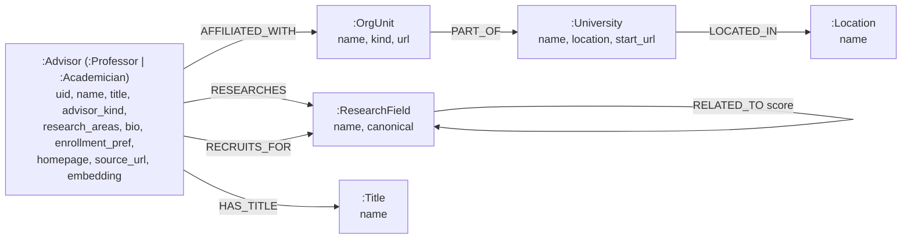

# Graph Builder Design

> Status: Draft v2 (under review)
> Date: 2026-06-12
> Scope owner: architecture
> Branch: `neo`

---

## 0. Document metadata

| Item | Content |
| --- | --- |
| Goal | Define a **Python offline batch builder** that turns the **facts** and **semantics** in each crawler DB `data/universities/<host>.edu.cn.db` into a **Neo4j knowledge graph**, to underpin a future recommendation system. |
| In scope | The graph builder: source reading, entity/relationship modeling, vector embedding, research-field normalization, Neo4j writes + indexes, incremental builds, build speed, tests and quality evaluation. |
| Out of scope (this cycle) | The recommendation service (Go/Python — "discuss later"), the APP, and rewriting `推荐系统需求分析.md`. |
| Supersedes & retires | The SQLite prototype `src/agents/recommender/graph_agent.py` (`KnowledgeGraphAgent`), its `kg_*` store (`recommender/db/*`), and the dependent prototype recommender (`recommender/agent.py` + the `recommend` CLI) — TF-IDF keyword lookup only (no embeddings, no spec, no evaluation). **Retired** (removed in P1, not flag-gated); git history is the only reference. |
| Locked decisions | Storage = Neo4j; semantics = cloud embeddings + LLM research-field normalization (Approach B); embedder pluggable, default Qwen `text-embedding-v3`; advisors share an `:Advisor` umbrella **but academicians (院士) are a special, separately-handled class**; builds are incremental, speed-budgeted, and intentionally extensible. |

---

## 1. Background and goals

### 1.1 Current state and problems

A "graph + recommender" prototype already exists (`src/agents/recommender/`) but was **not built against any substantial spec**, and is unreliable:

- **"Semantic" is not semantic.** `text.py` uses Chinese 2–6 gram + TF-IDF inverted index (`kg_terms`) — no vector embeddings, no synonym / discipline-hierarchy expansion. "AI + 医疗" only matches advisors whose text literally contains those n-grams; it cannot reach "医学影像" advisors across domains.
- **Ranking weights are hardcoded**, and user-intent parsing **silently degrades** to keyword rules when no API key is present.
- **No evaluation.** Reliability has never been measured.

### 1.2 Goals

Build a knowledge graph that is **trustworthy, explainable, measurable, incrementally updatable, and fast to build**:

1. Faithfully represent **facts**: advisor ↔ org unit ↔ university ↔ location ↔ title structure.
2. Represent **semantics**: vector embeddings of advisor text + a normalized `ResearchField` hierarchy and relatedness graph, enabling cross-domain recall and similarity search.
3. Produce a **language-agnostic graph database** (Neo4j) that a later recommendation service consumes in any language (Python / Go) via Bolt + Cypher + vector search.
4. Be **repeatable and incremental**: source-level and entity-level incremental builds, idempotent writes, and a build-run ledger make every build auditable.
5. Be **safe**: read-only access to source DBs; **exclude the in-flight `sjtu.edu.cn.db` by default**.
6. Be **fast**: build speed is a design constraint (§12), not an afterthought.

---

## 2. Scope and boundaries

### 2.1 The builder is an "offline batch producer"

This is the design choice that lets "Go vs Python for the recommendation service" stay deferred:

```
  read-only input                builder (this doc, Python)              output
┌────────────────────┐      ┌──────────────────────────────┐    ┌──────────────────────────┐
│ data/universities/ │ ───▶ │ read → normalize → embed →     │ ──▶│ Neo4j graph                │
│ <host>.edu.cn.db   │      │ write → index → derive edges → │    │ (facts + vectors + edges)  │
└────────────────────┘      │ write ledger                   │    │ + BuildRun ledger          │
                            └──────────────────────────────┘    └──────────────────────────┘
                                                                            │
                                              discuss later (out of scope)  ▼
                                                                ┌──────────────────────────┐
                                                                │ recommendation service     │
                                                                │ (Python/Go) — READS Neo4j   │
                                                                └──────────────────────────┘
```

- The builder **never** serves user queries; it only produces the graph.
- The recommendation service is a **separate consumer** that only reads Neo4j (vector ANN + Cypher traversal). The contract is "what's in the graph" (see the Consumer contract section), not a Python API — so a later Go service can connect via the Neo4j Go driver.
- The builder **never writes** the source DBs `*.edu.cn.db`.

### 2.2 Explicitly not done

Recommendation ranking/explanation logic, user-intent parsing, API, APP, and rewriting `推荐系统需求分析.md` are all out of scope this cycle. This doc only guarantees that the graph's content and quality are sufficient for those capabilities to be built **reliably later** (§13 documents the headroom left for them).

---

## 3. Key design decisions

### 3.1 Storage: Neo4j (chosen)

Neo4j is chosen. The trade-off is recorded for traceability:

| Dimension | SQLite (old prototype) | **Neo4j (this design)** |
| --- | --- | --- |
| Multi-hop queries | Manual recursion / repeated JOINs | Native Cypher: `MATCH (a)-[:RESEARCHES]->()<-[:RESEARCHES]-(b)` in one line (similar advisors / cross-domain expansion) |
| Vector search | Needs sqlite-vec / FAISS bolt-on | **Native vector index** (5.11+, Lucene HNSW, cosine); graph and vectors in one store |
| Explainable paths | Hard | Return the path along explicit edges — naturally explainable |
| Ops | Zero-ops (file) | Must run/back up a server (the accepted cost) |
| Cross-language consumption | Each language reads SQLite | Official Python/Go/JS drivers — good for "Go service, discuss later" |
| Current scale | — | 7 schools (expanding to more 985/211), 10^4–10^5 advisors; a single Neo4j instance is ample |

> Vector index syntax (5.11+):
> ```cypher
> CREATE VECTOR INDEX advisor_embedding IF NOT EXISTS
> FOR (a:Advisor) ON (a.embedding)
> OPTIONS { indexConfig: {
>   `vector.dimensions`: $dim,            // must match the chosen embedding model
>   `vector.similarity_function`: 'cosine'
> }};
> ```
> Query: `CALL db.index.vector.queryNodes('advisor_embedding', $k, $queryVector) YIELD node, score`.

### 3.2 Semantic layer: embeddings + LLM research-field normalization (Approach B, chosen)

On top of "vectors only," add a **build-time LLM normalization** pass: map free-text `research_areas`/`bio` onto **canonical `ResearchField` nodes** and emit `SUBFIELD_OF` / `RELATED_TO` edges (a real discipline hierarchy + synonym merging: `NLP` ≡ `自然语言处理`). The user confirmed "LLM token consumption is affordable for better results."

- The LLM pass sits behind a flag (`llm_field_normalization_enabled`): when off, it degrades to "vectors only + cosine-derived `RELATED_TO`" (Approach A), for a fast/cheap build or as an evaluation baseline.
- Normalization results are **cached by content hash** and only computed for changed/new phrases, to control cost and time (§12).

### 3.3 Embedding model: pluggable, default Qwen `text-embedding-v3`

- Goes through the repo's existing OpenAI-compatible `base_url`/`api_key` config path; **not bound** to OpenAI `text-embedding-3`.
- Recommended default: **Qwen `text-embedding-v3`** (DashScope, OpenAI-compatible, strong on Chinese, cheap/fast, configurable dimensions). Alternatives: `bge-m3` / `bge-small-zh` on a low-cost host (e.g. SiliconFlow), or a local `bge` later.
- **Model and dimensions are config-driven**; the vector index dimension is derived from config, so switching models needs no code change (only re-embedding).

### 3.4 Advisor space, with academicians (院士) as a special class

The source has two tables, `professors` and `academicians`. Advisors share an **`:Advisor`** umbrella (multi-labelled `:Professor` / `:Academician`) so the **whole advisor space shares one vector index** and retrieval is uniform. But **academicians are first-class special**, not a mere role tag:

- **Why special.** Very few students can realistically secure (套磁) an academician as their advisor. Blending them into ordinary professor recommendations would pollute results with effectively unreachable targets.
- **Detection.** `advisor_kind = 'academician'` when the row comes from the `academicians` table **or** when `title` contains `院士`. On dedup (same person in both tables), academician status wins.
- **Handling.** Academicians stay embedded and searchable, but carry a distinct `:Academician` label + `advisor_kind`, so the consumer can treat them specially — by default surfaced in a **separate "aspirational / hard-to-reach" bucket**, or down-weighted/filtered, never silently blended into the main list. The graph makes the distinction explicit and queryable; the *policy* lives in the consumer (see the Consumer contract section).

---

## 4. Data source (facts)

### 4.1 Source: per-university crawler DBs

- Path: `data/universities/<host>.edu.cn.db` (one SQLite DB per school).
- Selection reuses `agents/data_steward/db/selector.resolve_targets(...)` (filter by school name / DB name; with no filter it globs top-level `*.db` — backups live in subdirectories and are unaffected).
- **The "public tables" read are defined by `agents/data_steward/db/exporter.PUBLIC_TABLES`** (i.e. the clean-export contract surface):

| Table | Key columns (actual schema, see `crawler/models.py`) |
| --- | --- |
| `university_meta` | `name, start_url, location, crawl_status` |
| `org_units` | `id, name, url, kind, status` (colleges/departments/institutes, distinguished by `kind`) |
| `professors` | `id, name, name_key, org_unit_name, title, research_areas, email, phone, homepage, external_link, bio, enrollment_pref, publications` |
| `academicians` | same + `org_unit_id` (FK), `source_url` |
| `professor_affiliations` | `professor_id, org_unit_id, source_url` (advisor↔org_unit many-to-many) |

- All free-text Chinese, ~90% accuracy overall (with missing/stale/inconsistent values). The builder must be robust to missing fields (never fabricate).

### 4.2 Safety guard: exclude SJTU

`sjtu.edu.cn.db` **is being written**. With no filter, `resolve_targets` includes it by default, so:

- Add config `graph_build_exclude_dbs`, **default `["sjtu.edu.cn.db"]`**; filter it out of the target set before building.
- Open all source DBs with a **read-only URI** (`file:...?mode=ro`) to eliminate any write risk.
- Log excluded DBs explicitly so a "silent skip" is never mistaken for "fully built."

---

## 5. Target graph model (Neo4j schema)

### 5.1 Nodes and relationships



| Node label | Key properties | Source |
| --- | --- | --- |
| `:University` | `name` (unique), `location`, `start_url`, `source_db` | `university_meta` |
| `:OrgUnit` | `name`, `kind`, `url` | `org_units` |
| `:Advisor` (+`:Professor` **or** `:Academician`) | `uid` (unique, stable), `name`, `name_key`, `title`, `advisor_kind` (`professor`/`academician`), `research_areas`, `bio`, `enrollment_pref`, `publications`, `email`, `phone`, `homepage`, `external_link`, `source_url`, `embedding` (vector) | `professors`/`academicians` |
| `:ResearchField` | `name`, `canonical` (normalized name), `aliases` | derived from `research_areas`/`bio` via LLM normalization |
| `:Title` | `name` (教授/副教授/研究员/院士…) | `title` |
| `:Location` | `name` (city/province) | `university_meta.location` |

| Relationship | Meaning | Source |
| --- | --- | --- |
| `(:OrgUnit)-[:PART_OF]->(:University)` | org unit belongs to a university | structural |
| `(:Advisor)-[:AFFILIATED_WITH]->(:OrgUnit)` | advisor belongs to an org unit (M:N) | `professor_affiliations` / `org_unit_name` |
| `(:Advisor)-[:RESEARCHES {weight}]->(:ResearchField)` | researches a field | `research_areas`/`bio` normalized |
| `(:Advisor)-[:RECRUITS_FOR]->(:ResearchField)` | recruiting preference field | `enrollment_pref` |
| `(:Advisor)-[:HAS_TITLE]->(:Title)` | title | `title` |
| `(:University)-[:LOCATED_IN]->(:Location)` | university located in a place | `location` |
| `(:ResearchField)-[:SUBFIELD_OF]->(:ResearchField)` | discipline hierarchy | LLM normalization |
| `(:ResearchField)-[:RELATED_TO {score}]->(:ResearchField)` | related fields (incl. synonyms) | LLM + vector cosine |

> **Academicians**: the same nodes also carry the `:Academician` label and `advisor_kind = 'academician'`. Consumers filter or bucket them separately (see §3.4 and the Consumer contract section) — they are searchable but never silently blended into normal professor results.
> **Optional**: `(:Advisor)-[:SIMILAR_TO {score}]->(:Advisor)` (derived from vector top-k), for "similar advisors." Off by default, as a derived extension.

### 5.2 Stable primary key (uid)

- `uid = "<source_prefix>:advisor:<table>:<row_id>"`, where `source_prefix` is a hash of the source DB's absolute path (following the old prototype's `_source_prefix` idea).
- All writes use `MERGE (a:Advisor {uid})` to guarantee **idempotency** and cross-build updatability.
- `:University` is merged on `name`; `:ResearchField`/`:Title`/`:Location` are merged on `canonical`/`name` (shared across schools, forming a global discipline/location network).

### 5.3 Constraints and indexes

```cypher
CREATE CONSTRAINT advisor_uid     IF NOT EXISTS FOR (a:Advisor)       REQUIRE a.uid IS UNIQUE;
CREATE CONSTRAINT university_name IF NOT EXISTS FOR (u:University)    REQUIRE u.name IS UNIQUE;
CREATE CONSTRAINT field_canonical IF NOT EXISTS FOR (f:ResearchField) REQUIRE f.canonical IS UNIQUE;
CREATE INDEX advisor_name         IF NOT EXISTS FOR (a:Advisor) ON (a.name);
CREATE INDEX advisor_kind         IF NOT EXISTS FOR (a:Advisor) ON (a.advisor_kind);
CREATE INDEX orgunit_name         IF NOT EXISTS FOR (o:OrgUnit) ON (o.name);
CREATE FULLTEXT INDEX advisor_doc IF NOT EXISTS FOR (a:Advisor) ON EACH [a.name, a.research_areas, a.bio, a.enrollment_pref];
CREATE VECTOR INDEX advisor_embedding IF NOT EXISTS
  FOR (a:Advisor) ON (a.embedding)
  OPTIONS { indexConfig: { `vector.dimensions`: $dim, `vector.similarity_function`: 'cosine' } };
```

The full-text index `advisor_doc` supports later **hybrid retrieval** (vector + lexical); the `advisor_kind` index makes "exclude/bucket academicians" cheap.

---

## 6. Build pipeline

Each source DB is processed independently, incrementally, and idempotently; one failed DB does not affect others.

| Stage | Action | Reuse / new |
| --- | --- | --- |
| ① Select + guard | `resolve_targets` resolves targets; filter SJTU per `graph_build_exclude_dbs`; skip unchanged sources by content hash + mtime | reuse `selector`; store hash in ledger (old `kg_sources` idea) |
| ② Read facts | Read-only read of the 5 public tables; tag `advisor_kind` (academicians table **or** `院士` in title) | reuse the read logic in `graph_agent._read_source` (migrated) |
| ③ Normalize | Name normalization/dedup (`name_key`); **collect unique** research-field phrases → LLM-normalize each once → canonical `ResearchField` + `SUBFIELD_OF`/`RELATED_TO` (dedup-before-call for speed, §12) | reuse `crawler/sanitizer.normalize_name`; new normalizer module |
| ④ Embed | Build advisor document string → call embedding API in batches → vector; **cache by content hash**, skip re-embedding unchanged advisors (§12) | new `EmbeddingClient` (in `runtime/`) |
| ⑤ Write | Idempotent batched `UNWIND … MERGE` of nodes/relationships/vector property; on a changed source, **delete that source's subgraph then rewrite** | new Neo4j repository |
| ⑥ Index | Ensure constraints + full-text + vector index exist (dimension from config) | new schema/cypher |
| ⑦ Derive semantic edges | `RELATED_TO` between `ResearchField`s (vector cosine ≥ threshold, top-k, or LLM-corrected); optional `SIMILAR_TO` | new |
| ⑧ Write ledger | Record a `BuildRun`: per-stage counts, errors, **per-stage timing**, embedding model + dimensions | new |

**Advisor document string** (for embedding and full-text):
```
{name} | {title} | fields: {research_areas} | recruiting: {enrollment_pref} | bio: {bio} | pubs: {publications} | {org_unit_name} | {university} | {location}
```

**Incremental & idempotent**: source-hash skip + per-advisor content-hash skip + `MERGE` upserts + delete-and-rewrite for changed sources; re-runnable; a failed source is recorded in the ledger and the rest continue.

---

## 7. Semantic layer details

### 7.1 Vector embedding (cloud, pluggable)

- Client: a new **`EmbeddingClient`** living in **`src/runtime/embeddings.py`** (sibling of `runtime/llm.py::LLMClient`), wrapping `AsyncOpenAI(base_url, api_key).embeddings.create(model, input=[...], dimensions=...)`; batched, rate-limited, retried (reusing the retry/limit patterns from `LLMClient`). Placed in `runtime/` because embeddings are a shared runtime capability, not builder-specific.
- Model/dimensions from config; cache key = `sha1(model + document_string)`; on hit, skip the API call.
- Written to Neo4j as `a.embedding` (list[float]); vector index dimension = configured dimension.

### 7.2 LLM research-field normalization (Approach B)

- Input: the set of **unique** raw field phrases (split from `research_areas`/`bio`), deduplicated across all advisors so each phrase is normalized at most once.
- Prompt the LLM to output, per raw phrase: a `canonical` normalized name, `aliases`, an optional `parent` (super-discipline), and optional `related` fields. Strict JSON.
- Produces `:ResearchField{canonical}` nodes (merged/shared across schools), `SUBFIELD_OF`, and `RELATED_TO` edges.
- Reuses the existing `runtime/llm.LLMClient.chat` (already has JSON repair, retry, rate limiting). Normalization results cached by content hash.

### 7.3 Derived relatedness edges

- LLM off: cosine top-k over `ResearchField` vectors (or their representative advisor vectors); `RELATED_TO` when ≥ `related_field_min_score`.
- LLM on: LLM `related`/`parent` are primary; vector results supplement.

### 7.4 Explainability

Matches flow along **explicit edges** (`RESEARCHES`/`RELATED_TO`/`AFFILIATED_WITH`/`LOCATED_IN`), so a consumer can return a **path-based reason**: "matched 医学影像 ←RELATED_TO 计算机视觉; advisor's university is in 上海." This is the explainability the old prototype could not provide.

---

## 8. Modules and code structure (proposed)

A new package keeps the builder decoupled from the "prior SQLite prototype". The embedding client lives in `runtime/`:

```
src/runtime/
  llm.py                # existing LLMClient
  embeddings.py         # NEW: EmbeddingClient (sibling of LLMClient)

src/agents/graph_builder/
  __init__.py
  builder.py            # GraphBuilder: orchestrates the §6 pipeline
  config.py             # read/validate graph-related config (or fold into CrawlerSettings)
  source_reader.py      # read-only read of the 5 public tables (migrated from graph_agent._read_source)
  documents.py          # advisor document-string construction + content hashing
  field_normalizer.py   # LLM research-field normalization (+ cache, dedup-before-call)
  neo4j_repository.py    # connection + batched MERGE writes + indexes/constraints + ledger
  cypher.py             # central store of Cypher statements (schema/write/derive)
  models.py             # GraphBuildSummary / node & edge DTOs

tests/unit/graph_builder/        # unit tests
tests/integration/graph_builder/ # ephemeral-Neo4j integration tests
```

**Reuse existing code**: `data_steward.db.selector.resolve_targets`, `data_steward.db.exporter.PUBLIC_TABLES`, `crawler.sanitizer`, `crawler.config.CrawlerSettings`, `runtime.llm.LLMClient`.
**New code**: `runtime.embeddings.EmbeddingClient` (reuses the `AsyncOpenAI` + retry/limit patterns of `runtime.llm`), the `graph_builder` package.
**New dependency**: `neo4j` (official async driver). Embeddings use the `.embeddings` API of the already-present `openai` package.

> **Retirement (decided).** The old `recommender/graph_agent.py` (SQLite), `recommender/db/*` (`kg_*`), and the dependent prototype `recommender/agent.py` + `recommend` CLI + their tests are **removed in P1** — the SQLite version is retired, not kept behind a flag. The future recommendation service is built fresh against Neo4j in a separate cycle.

---

## 9. Configuration (extend `CrawlerSettings`, prefix `YANCLAW_`)

| Config | Default | Notes |
| --- | --- | --- |
| `neo4j_uri` | `bolt://127.0.0.1:7687` | Neo4j connection |
| `neo4j_user` / `neo4j_password` | `neo4j` / required (no default) | auth |
| `neo4j_database` | `neo4j` | database name |
| `embedding_base_url` / `embedding_api_key` | fall back to `openai_base_url`/`openai_api_key` | embedding service (OpenAI-compatible) |
| `embedding_model` | `text-embedding-v3` (Qwen) | pluggable |
| `embedding_dimensions` | model-dependent (e.g. 1024) | vector index dimension must match |
| `embedding_batch_size` | 64 | batch embedding (build speed, §12) |
| `embedding_max_concurrent` | 8 | concurrent embedding requests |
| `graph_build_exclude_dbs` | `["sjtu.edu.cn.db"]` | **exclude the in-flight DB** |
| `llm_field_normalization_enabled` | `true` | Approach B switch |
| `related_field_top_k` | 8 | neighbors for derived `RELATED_TO` |
| `related_field_min_score` | 0.80 | cosine threshold |
| `neo4j_write_batch_size` | 500 | rows per `UNWIND … MERGE` round-trip (build speed, §12) |

---

## 10. CLI and running

- Reuse the existing `graph` command group: **repoint `graph build`** to the new Neo4j `GraphBuilder`. The old SQLite path is **retired (removed)**, not flag-gated; the prototype `recommend` command is removed with it (the recommendation service is a separate, deferred cycle).
- Usage:
  ```bash
  uv run yanclaw graph build                      # all (SJTU already excluded)
  uv run yanclaw graph build --universities 北京大学,四川大学
  uv run yanclaw graph build --rebuild            # clear and rebuild
  ```
- Outputs a `GraphBuildSummary`: sources seen/indexed/skipped, node/edge/vector counts, per-stage timing, errors, model + dimensions used.

---

## 11. Error handling and safety

- **Read-only sources**: all source DBs opened `mode=ro`; never write the source DBs.
- **SJTU guard**: excluded by default + logged explicitly.
- **Source isolation**: per-source `try/except`; errors go to the ledger, the rest continue (following the old prototype's fault tolerance).
- **Idempotent**: `MERGE` + delete-and-rewrite for changed sources; re-runnable with no side effects.
- **Cost control**: embedding cache + normalization cache + source-hash skip.
- **No fabrication**: missing fields stay empty; the advisor document string contains only existing facts.

---

## 12. Performance and build speed

Build time is dominated by three network-bound costs: embedding API calls, LLM normalization calls, and Neo4j write round-trips. Naive per-row synchronous calls would be far too slow, so speed is a **design constraint**, not an afterthought.

| Lever | Approach |
| --- | --- |
| Deduplicate before calling | Normalize each **unique** research-field phrase once (not per advisor); embeddings keyed by content hash, so unchanged advisors cost zero API calls on re-build. |
| Batch + concurrency | `EmbeddingClient` packs `embedding_batch_size` inputs per request and runs up to `embedding_max_concurrent` requests; LLM normalization batches many phrases per call. |
| Batched Neo4j writes | Write with `UNWIND $rows AS row MERGE …` — `neo4j_write_batch_size` nodes/edges per round-trip inside a transaction, periodic commits, one reused driver/session. No per-node round-trips. |
| Incremental | Source-hash skip → re-builds touch only changed schools; per-advisor content-hash → only changed advisors re-embed. |
| Index discipline | Ensure the vector index once; bulk-load nodes, then let HNSW populate (HNSW build has a real cost). |

**Initial targets (to validate, recorded in the ledger):**
- Cold full build of the current ~7 schools: on the order of minutes (dominated by first-time embedding/LLM).
- Warm incremental with no source changes: seconds.
- One changed school: time proportional to that school only.

Per-stage timing is written to the `BuildRun` ledger so regressions are visible build-over-build.

---

## 13. Extensibility and evolution (room to improve)

The spec deliberately fixes only the **core graph contract** (see the Consumer contract section) and keeps capability growth additive:

- **Tiered incremental updates**: (a) per-source skip (now); (b) per-advisor content-hash skip (now); (c) future event-driven updates — a single advisor upserted on a crawler/steward write, no full pass. The stable `uid` + `MERGE` make per-entity updates safe.
- **Additive schema**: new node/edge types (papers, projects, funding, enrollment quotas, student outcomes) can be added later without migrating existing data — Neo4j is schema-flexible and the builder simply writes new labels/edges alongside.
- **Pluggable components**: embedder, normalization LLM, and related-edge derivation sit behind interfaces/flags, so models or strategies can be swapped without touching the pipeline.
- **Versioning & A/B**: `BuildRun` records builder version + model + dimensions; a build can target a fresh graph/database name for comparison; the dimension-change → reindex path is documented.
- **Quality hooks**: rerankers, curated synonym dictionaries, and manual steward corrections can be merged as extra edges/properties without breaking the consumer contract.

---

## 14. Testing and quality evaluation (make "reliable" measurable)

### 14.1 Unit tests
- Cypher schema/index/constraint creation (incl. `IF NOT EXISTS` idempotency).
- `MERGE` write idempotency (repeated writes produce no duplicate nodes/edges).
- Advisor document-string construction, content hashing, embedding cache hits.
- **Academician classification** (`advisor_kind` from the academicians table **or** `院士` title; `:Academician` label applied; academician wins on cross-table dedup).
- **SJTU exclusion guard** (assert it is filtered out).
- Research-field normalization (synonym merge, hierarchy generation, dedup-before-call).

### 14.2 Integration tests
- Ephemeral Neo4j (testcontainers or a local test instance): run the full pipeline on a **small fixture source DB** → assert node/edge/vector counts, constraints present, academicians labelled, and that one `db.index.vector.queryNodes` call recalls the expected advisor.

### 14.3 Graph-quality acceptance metrics (written to the ledger, tracked per build)
| Metric | Meaning |
| --- | --- |
| Entity coverage | ratio of source advisors/org-units/universities → graph nodes |
| Embedding coverage | ratio of `:Advisor` nodes that have an `embedding` |
| Field-normalization convergence | merge rate of raw field phrases → canonical `ResearchField` |
| Orphan rate | ratio of nodes with no relationships (should be low) |
| Vector smoke test | given a query vector, top-k recall returns sensible results/scores |
| Build duration | per-stage and total wall-clock (regression signal, §12) |

> A retrieval-relevance eval set (Recall@k / nDCG@k) depends on a query layer and belongs to the recommendation service; **reserved** this cycle: keep ledger fields for it, wire a 20–30 labeled-query set in during the service phase.

---

## 15. Consumer contract (for the future recommendation service, language-agnostic)

What the builder exposes is just the **graph shape + two query primitives**:

1. **Vector ANN** (optionally excluding academicians from the main list):
   ```cypher
   CALL db.index.vector.queryNodes('advisor_embedding', $k, $queryVector)
   YIELD node AS advisor, score
   WHERE advisor.advisor_kind = 'professor'   // academicians handled in a separate bucket
   RETURN advisor, score;
   ```
2. **Graph traversal** (cross-domain expansion + structural filtering + explainable path):
   ```cypher
   MATCH (a:Advisor)-[:RESEARCHES|RECRUITS_FOR]->(f:ResearchField)
   WHERE f.canonical IN $fields
      OR (f)-[:RELATED_TO]->(:ResearchField {canonical: $seedField})
   MATCH (a)-[:AFFILIATED_WITH]->(o:OrgUnit)-[:PART_OF]->(u:University)-[:LOCATED_IN]->(l:Location)
   WHERE ($location IS NULL OR l.name = $location)
   RETURN a, o, u, l, a.advisor_kind AS kind;
   ```

A later Go service connects via `github.com/neo4j/neo4j-go-driver` — no Python interface required. **This is exactly the value of choosing Neo4j for the deferred "Go, discuss later" decision.**

---

## 16. Phased implementation plan

| Phase | Content | Output |
| --- | --- | --- |
| P1 Skeleton + facts + retire SQLite | package layout, Neo4j connection, schema/constraints, read 5 tables, `advisor_kind` tagging, batched `MERGE` nodes/structural relationships, SJTU guard, repoint `graph build`, **remove the SQLite `graph_agent` + `recommender/db` + prototype `recommend` + their tests**, unit tests | a facts-only graph (academicians distinguished) can be built; SQLite version gone |
| P2 Embeddings + vector index | `EmbeddingClient` (in `runtime/`), document strings, content-hash cache, batching/concurrency, vector property + vector index, vector smoke test | vector recall works, build is fast |
| P3 LLM normalization + derived edges | `field_normalizer` (dedup-before-call), `ResearchField` hierarchy, `RELATED_TO`, full-text index | cross-domain / synonym / explainable |
| P4 Evaluation + ledger | graph-quality metrics, per-stage timing, complete `BuildRun` fields, integration tests | measurable, auditable, speed-tracked |

---

## 17. Open questions (confirm before implementation)

1. **Neo4j deployment shape**: version (need ≥ 5.11 for the native vector index), Docker/local, auth, whether Community edition suffices.
2. **Final embedding model + dimensions**: confirm default Qwen `text-embedding-v3` and its output dimension (e.g. 1024) to fix the vector index dimension.
3. **Normalization LLM model**: reuse `openai_model` (e.g. `gpt-4o-mini`) or configure a separate one?
4. **Discipline taxonomy seed**: let the LLM generate freely, or provide a top-level discipline seed (CS / EE / medicine …) to constrain the hierarchy?
5. **professor/academician dedup key**: merge the same person across both tables into one `:Advisor` by `name_key + university` (academician status wins, §3.4) — confirm this key is robust against homonyms at large schools.
6. **Location granularity**: should `location` be split into city/province with a `LOCATED_IN` chain (`city-[IN]->province`)?
7. **Academician policy default**: separate "aspirational" bucket vs. down-weight vs. opt-in only — confirm the default the graph should make easy (the graph supports all; this just sets the recommended default for the consumer).

---

## 18. Appendix: mapping from the old (retired) SQLite prototype

> The SQLite prototype is **retired** (removed in P1). This mapping is for reference / git archaeology only.

| Old (SQLite `kg_*`) | New (Neo4j) |
| --- | --- |
| `kg_nodes` (type = university/org_unit/professor/concept) | `:University` / `:OrgUnit` / `:Advisor` / `:ResearchField` |
| `kg_edges` (LOCATED_IN/HAS_ORG_UNIT/AFFILIATED_WITH/RESEARCHES/RECRUITS_FOR/HAS_TITLE) | same/similar relationships (`HAS_ORG_UNIT` → `PART_OF`, reversed) |
| `kg_documents` + `kg_terms` (TF-IDF) | full-text index `advisor_doc` + **vector index** (semantic upgrade) |
| `kg_sources` (hash/mtime incremental) | `BuildRun` ledger + source-hash + per-advisor content-hash skip |
| `concept` (regex tokenization) | `:ResearchField` (**LLM normalization** + hierarchy — a qualitative leap) |
| (academicians flattened into professors) | **`:Academician` special class** (`advisor_kind`, separate bucket) |
